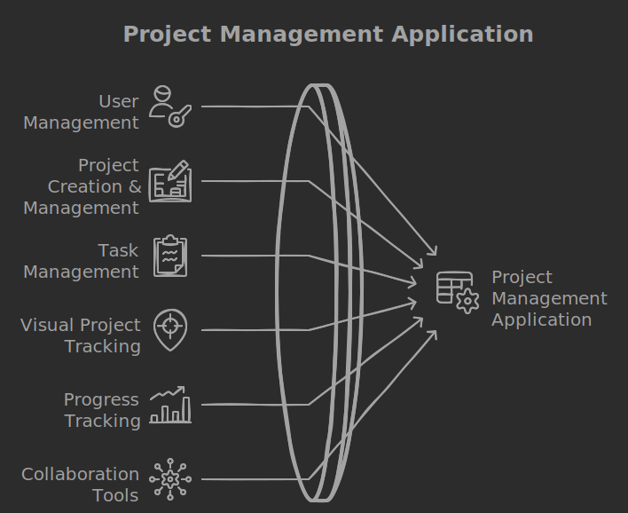
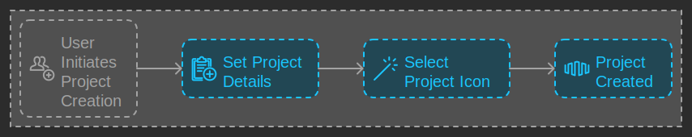
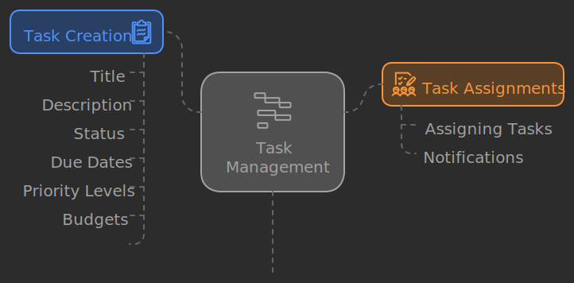
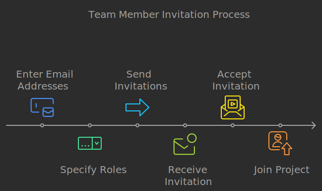

# Project management application

Here’s a detailed description of essential project management features:

### 1. User Management

- **User Roles & Permissions**: Assign different roles (admin, member, guest) with varying access levels.
- **User Profiles**: Personal profiles with contact info, email, location, birhtday and task assignments.

### 2. Project Creation & Management

- **Create Project**: Allow users to create and set icon for that project.

### 3. Task Management

- **Task Creation**: Easy task creation with details such as task title, description, status, due dates, priority levels, Budgets, timeline (from-to).
- **Subtasks**: Break larger tasks into smaller, manageable subtasks.
- **Task Assignments**: Assign tasks to team members with notifications.

### 4. Visual Project Tracking

- **Kanban Boards**: Visualize workflow using drag-and-drop boards for task stages (To Do, In Progress, Done).
- **Gantt Charts**: Provide a timeline view of tasks, dependencies.
- **Calendar View**: A calendar to visualize deadlines.

### 5. Progress Tracking

- **Status Updates**: Allow team members to update the status of tasks (e.g., Not Started, In Progress, Completed).
- **Progress Bar/Indicators**: Visual representation of task completion percentages.

### 6. Collaboration Tools

- **Comments & Mentions**: Enable team members to comment on tasks and mention others for notifications.
- **File Attachments**: Allow users to attach documents, images, and other files to tasks.

### 6. Reporting & Analytics

- **Dashboard**: A customizable dashboard that shows key project metrics, progress, and team performance

### 7. Client Access

- **Client Portal**: Allow clients to view project status and communicate with the team without full access.

### 8. Team Member Invitation

- **Email Invitations**: Users can invite team members by entering their email addresses.
- **Role Assignment**: Allow users to specify roles (admin, member, guest) during the invitation process.
- **Acceptance Workflow**: Upon receiving the invitation, team members can accept via a link that directs them to set up their profiles.

